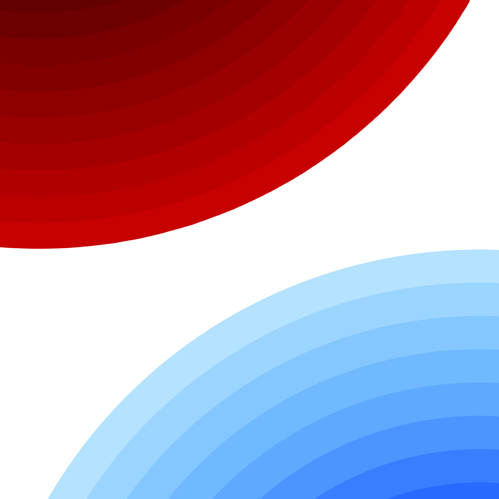
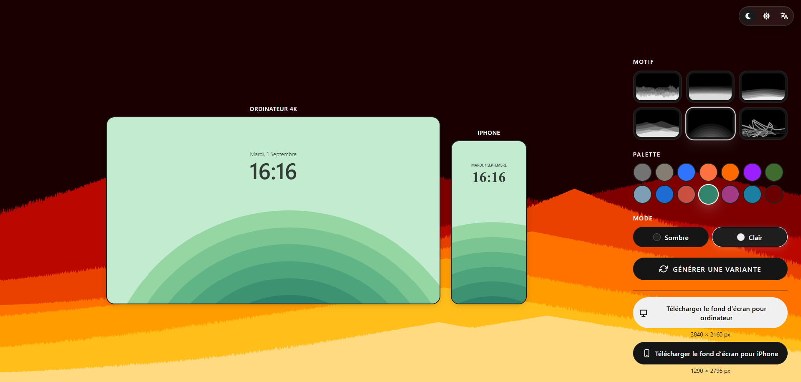

#   WallpGen — Wallpaper Generator

[](./LICENSE)

[]()
[]()
[]()

Minimalist procedural wallpaper generator. Algorithmic patterns, 8+ harmonious palettes, high-resolution exports. **Zero dependencies.**



---

## 📑 Table of Contents

* [✨ Features](#-features)

* [🚀 Quick Start](#-quick-start)

* [💻 Tech Stack](#-tech-stack)

* [📁 Architecture](#-architecture)

* [🛠️ Extension](#-extension)

* [📋 License](#-license)

---

## ✨ Features

| Feature                    | Description                                              |
| -------------------------- | -------------------------------------------------------- |
| 🎨 **Infinite Generation** | Unique procedural patterns with every variation          |
| 👁️ **Dual Preview**       | Desktop 4K (3840×2160) + iPhone (1290×2796) side by side |
| 🎭 **8+ Palettes**         | Ready-to-use harmonious color combinations               |
| 🌓 **Dark/Light**          | Themes with local persistence                            |
| 🌍 **Multilingual**        | EN, FR, ES, DE ... (extensible)                              |
| ✨ **Microinteractions**    | Ripple effects, smooth animations                        |
| 📱 **Responsive**          | Mobile, tablet, desktop                                  |

---

## 🚀 Quick Start

### Clone & serve

```bash
git clone https://github.com/yourusername/wallpgen.git

cd wallpgen

python3 -m http.server 8080
```

Access: [`http://localhost:8080`](http://localhost:8080)

---

## 💻 Tech Stack

**Pure vanilla:** HTML5 + CSS3 + ES6 Modules + Canvas 2D API

* ✅ Zero framework
* ✅ Zero polyfill
* ✅ SEO-friendly

---


## 🛠️ Extension

### Add a pattern

**File:** `src/engine.js`

```javascript
const drawPattern_custom = (ctx, w, h, palette, isDark) => {

  const colors = isDark ? palette.darkVariant : palette.colors;

  // Your algorithmic implementation

  for (let i = 0; i < 100; i++) {

    ctx.fillStyle = colors[i % colors.length];

    ctx.fillRect(

      Math.random() * w,

      Math.random() * h,

      50,

      50

    );

  }

};

PATTERNS.push("custom");
```

### Add a palette

**File:** `src/engine.js`

```javascript
PALETTES.push({

  name: "Aurora",

  colors: ["#FF1493", "#00CED1", "#FFD700", "#20B2AA"],

  darkVariant: ["#FF1493", "#00CED1", "#FFD700", "#20B2AA"]

});
```

### Add a language

**File:** `src/translate.js`

```javascript
const translations = {

  ja: {

    "preview.desktop": "デスクトップ",

    "preview.iphone": "iPhone",

    "button.export": "エクスポート",

    // ... complete with missing keys

  }

};

// In getAvailableLanguages():

if (navigator.language.startsWith("ja")) return "ja";
```

### Customize the theme

**File:** `css/index.css` (CSS Variables)

```css
:root {

  --color-primary: #6366f1;

  --color-bg: #ffffff;

  --color-text: #1f2937;

  --border-radius: 12px;

  --transition: all 0.3s cubic-bezier(0.4, 0, 0.2, 1);

}

[data-theme="dark"] {

  --color-bg: #0f172a;

  --color-text: #f1f5f9;

}
```

---

## 📋 License

**PolyForm Noncommercial 1.0.0** — Copyright © 2026 Pyro

✅ Personal, educational, non-profit use
❌ Commercial sales, SaaS, embedding without a license

See [LICENSE](./LICENSE)

---

## 🤝 Contributing

PRs are welcome for:

* 🐛 Bug fixes
* 🎨 New patterns
* 🌍 Translations
* ⚡ Performance improvements

[See CONTRIBUTING.md](./CONTRIBUTING.md)